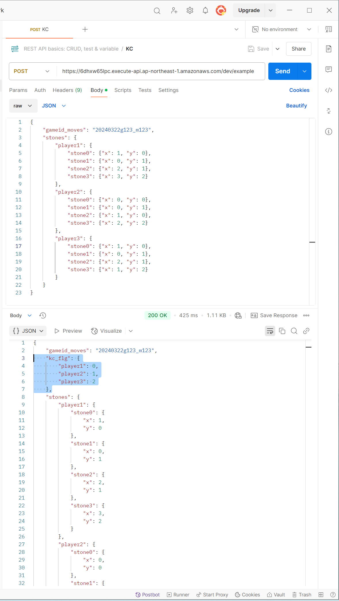

# KC_API
※更新履歴
- 2025/3/23
    - CORS未対応だったのを修正
    - DB登録対応
- 2025/3/31
    - リクエストボディのデータはそのままレスポンスするように修正

<br><br>

### リクエストサンプル
- 2025/3/23更新：
    - "gameid_moves" キー：　DB登録の際にユニークになるキー（ゲームIDと、何手目か、とかでどうでしょう？）
    があれば、全碁石の座標をDB登録します。
```json
{
    "gameid_moves": "20250331g123_m123",
    "stones": {
        "player1": {
            "stone0": {"x": 1, "y": 0},
            "stone1": {"x": 0, "y": 1},
            "stone2": {"x": 2, "y": 1},
            "stone3": {"x": 3, "y": 2}
        },
        "player2": {
            "stone0": {"x": 0, "y": 0},
            "stone1": {"x": 0, "y": 1},
            "stone2": {"x": 1, "y": 0},
            "stone3": {"x": 2, "y": 2}
        },
        "player3": {
            "stone0": {"x": 1, "y": 0},
            "stone1": {"x": 0, "y": 1},
            "stone2": {"x": 2, "y": 1},
            "stone3": {"x": 1, "y": 2}
        }
    }
}
```
### レスポンス例
リクエストボディのデータはそのままで、<br>
判定フラグを付加して返却する。
<br>
- kc_flg：
    - 0：特にフラグなし
    - 1：リーチ
    - 2：積み
```json
{
    "kc_flg": {
        "player1": 0,
        "player2": 1,
        "player3": 2
    }
}
```
<br><br>

## API使用方法
POSTで下記URLにリクエストを送信 \
https://6dhxw65lpc.execute-api.ap-northeast-1.amazonaws.com/dev/example

<br><br>
## Postman動作確認例


<br><br>
---
## Git Hub
https://github.com/mailtotakaf/kc

